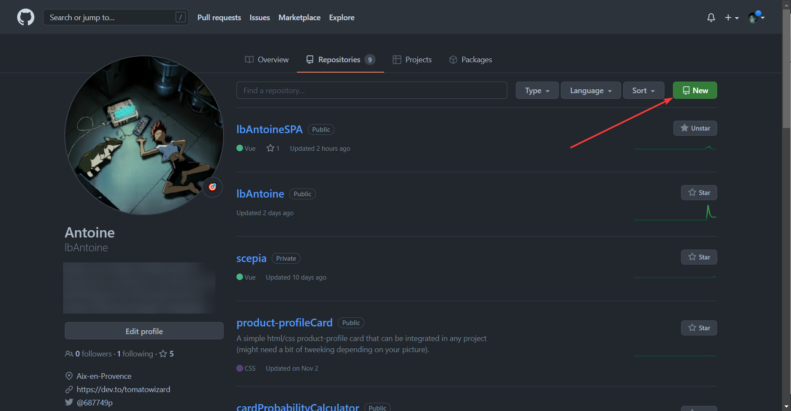
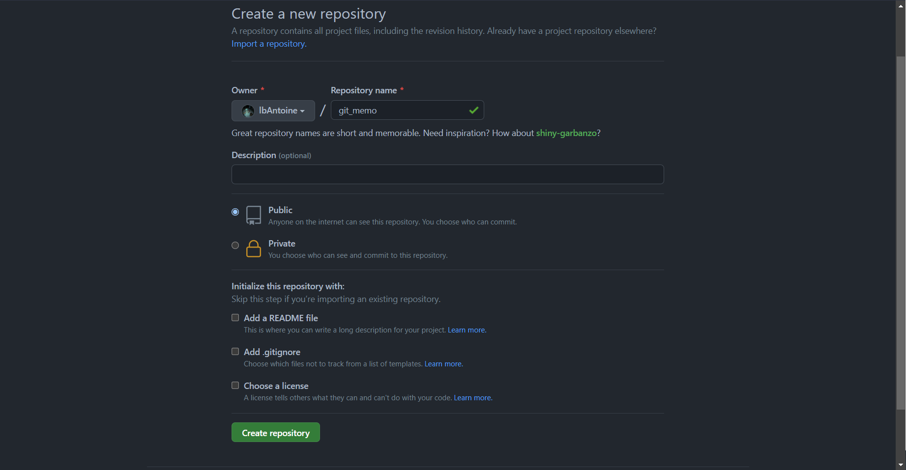

# **Mémo d'utilisation de git (seul ou en équipe)**

> Git est un logiciel de gestion de versions décentralisé. C'est un logiciel libre créé par Linus Torvalds, auteur du noyau Linux, et distribué selon les termes de la licence publique générale GNU version 2. Le principal contributeur actuel de git et depuis plus de 16 ans est Junio C Hamano. En 2016, il s’agit du logiciel de gestion de versions le plus populaire qui est utilisé par plus de douze millions de personnes.

*Source : [Wikipedia](https://fr.wikipedia.org/wiki/Git)*

Dans ce mémo je vais répertorier les différentes bonnes pratiques à adopter quand on utilise git, que ce soit pour un projet personnel ou un projet de grande envergure en équipe dans une entreprise.

---
Préambule : 

Bien que plusieurs solutions logicielles existent pour la gestion de projet git, ce mémo sera basé sur l'interface ligne de commande (soit dit en passant, les interfaces graphiques de gestion git -fork, gitkraken etc...- utilisent la ligne de commande en fond).
## 1. Bases de git

Que ce soit sur [GitHub](https://github.com/), [BitBucket](https://bitbucket.org/) ou [GitLab](https://gitlab.com/gitlab-org/gitlab) (à la préférence de chacun), l'utilisation de git est la même. Elle permet *grossièrement* de sauvegarder son projet en ligne de façon publique ou non, puis de permettre une meilleure gestion du travail sur un projet.

Ces solutions sont toutes présentées de la même façon, on créé un compte et notre profil est alimenté de *repositories* (répertoires), ce sont nos projets.

On peut ajouter à git les modifications sur un projet effectuées en local et les envoyer sur notre repository pour mettre à jour ce qui a été modifié (sans toucher au reste).

### 1.1 Création d'un repository et ajout d'un remote pour un nouveau projet

Quand on créé un nouveau projet (peu importe le type de projet ou le langage utilisé), on va créer un nouveau repository pour pouvoir l'accueillir. Pour l'exemple de ce mémo j'utiliserai github.

Pour créer un nouveau repository il suffit de se rendre sur son profil github dans l'onglet repository et de cliquer sur *new*. Puis le menu de création nous demande de nommer le repository et propose quelques options à cocher ou non. En général la seule option qui nous intéresse est de mettre le repo en public ou en privé. Dans notre exemple je vais créer un repo nommé 'git_memo' que je vais laisser en public.

<details>
<summary>Créer un nouveau repository</summary>
<br>
<div>


</div>
</details>
<br>
Admettons maintenant que nous avons déjà un projet en cours sur notre machine en local et que nous avons créé ce repo pour ce projet. Nous allons effectuer l'initialisation de ce repo en lien avec notre projet et effectuer notre première sauvegarde.

Pour cela, nous allons ouvrir notre invite de commande (ou powershell). Il faut bien vérifier que nous avons *git cli* d'installé sur notre machine pour qu'elle reconnaisse les commandes git.


D'abord rendez vous dans le dossier racine de votre projet.
```powershell
PS C:\Users\tomato> cd .\Documents\git_memo
```
Puis nous allons initialiser git dans ce dossier (pour pouvoir le lier au repo que nous venons de créer).
```powershell
~ git init
Initialized empty Git repository in C:/Users/Antoine/Documents/gitmemo/.git/
```