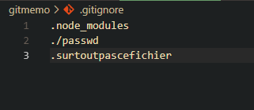
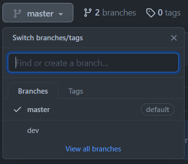

# **Mémo d'utilisation de git (seul ou en équipe)**

> Git est un logiciel de gestion de versions décentralisé. C'est un logiciel libre créé par Linus Torvalds, auteur du noyau Linux, et distribué selon les termes de la licence publique générale GNU version 2. Le principal contributeur actuel de git et depuis plus de 16 ans est Junio C Hamano. En 2016, il s’agit du logiciel de gestion de versions le plus populaire qui est utilisé par plus de douze millions de personnes.

*Source : [Wikipedia](https://fr.wikipedia.org/wiki/Git)*

Dans ce mémo je vais répertorier les différentes bonnes pratiques à adopter quand on utilise git, que ce soit pour un projet personnel ou un projet de grande envergure en équipe dans une entreprise.

---

**Table des matières**
- [1] [Bases de git](#1)
  - [1.1] [Création d'un repository et ajout d'un remote pour un nouveau projet](#1.1)
  - [1.2] [.gitignore](#1.2)
  - [1.3] [Les branches, travaille en équipe](#1.3)
- [2] [Gitflow, 3-way merge, conflits, hotfix, feature et release ...*coming soon*](#2)

---

Préambule : 

Bien que plusieurs solutions logicielles existent pour la gestion de projet git, ce mémo sera basé sur l'interface ligne de commande (soit dit en passant, les interfaces graphiques de gestion git -fork, gitkraken etc...- utilisent la ligne de commande en fond).
## 1. Bases de git

Que ce soit sur [GitHub](https://github.com/), [BitBucket](https://bitbucket.org/) ou [GitLab](https://gitlab.com/gitlab-org/gitlab) (à la préférence de chacun), l'utilisation de git est la même. Elle permet *grossièrement* de sauvegarder son projet en ligne de façon publique ou non, puis de permettre une meilleure gestion du travail sur un projet.

Ces solutions sont toutes présentées de la même façon, on créé un compte et notre profil est alimenté de *repositories* (répertoires), ce sont nos projets.

On peut ajouter à git les modifications sur un projet effectuées en local et les envoyer sur notre repository pour mettre à jour ce qui a été modifié (sans toucher au reste).

### 1.1 Création d'un repository et ajout d'un remote pour un nouveau projet

Quand on créé un nouveau projet (peu importe le type de projet ou le langage utilisé), on va créer un nouveau repository pour pouvoir l'accueillir. Pour l'exemple de ce mémo j'utiliserai github.

Pour créer un nouveau repository il suffit de se rendre sur son profil github dans l'onglet repository et de cliquer sur *new*. Puis le menu de création nous demande de nommer le repository et propose quelques options à cocher ou non. En général la seule option qui nous intéresse est de mettre le repo en public ou en privé. Dans notre exemple je vais créer un repo nommé 'git_memo' que je vais laisser en public.

<div align="center">
<details>
<summary>Créer un nouveau repository</summary>
<br>
<div>


</div>
</details>
</div>

<br><br>
Admettons maintenant que nous avons déjà un projet en cours sur notre machine en local et que nous avons créé ce repo pour ce projet. Nous allons effectuer l'initialisation de ce repo en lien avec notre projet et effectuer notre première sauvegarde.

Pour cela, nous allons ouvrir notre invite de commande (ou powershell). Il faut bien vérifier que nous avons *git cli* d'installé sur notre machine pour qu'elle reconnaisse les commandes git.


D'abord rendez vous dans le dossier racine de votre projet.
```powershell
PS C:\Users\tomato> cd .\Documents\git_memo
```
Puis nous allons initialiser git dans ce dossier (pour pouvoir le lier au repo que nous venons de créer).
```powershell
~ git init
```
Puis nous allons ajouter nos documents déjà existants de notre projet au client git pour pouvoir ensuite les envoyer dans notre repo.
```powershell
~ git add .
```
Le point signifie qu'il va récupérer tous les fichiers dans le dossier dans lequel nous nous trouvons. Maintenant nous allons effectuer un commit (assigner l'ajout à un futur envoi).
```powershell
~ git commit -m 'initial commit'

[master (root-commit) 6c716a4] initial commit
 3 files changed, 49 insertions(+)
 create mode 100644 assets/detailsRepo.png
 create mode 100644 assets/newRepo.png
 create mode 100644 git_memo.md
```
Le terminal vous sortira un message résumant les changements qui concernent votre projet en l'état dans lequel vous l'envoyer par rapport à l'état du projet existant dans le repo. Comme c'est le premier commit, tout est nouveau, il devrait donc vous faire une liste de tout ce qui a été sélectionné pour l'envoi. Le flag `-m` permet d'ajouter un message au commit, ce qui peut permettre de mieux comprendre la mise à jour d'un code si on travaille en équipe ou même pour soi-même.

Maintenant, avant d'envoyer nos fichiers, nous allons lier notre projet local à notre repo (eh oui ce n'est pas encore fait). Pour ce faire il faut récupérer le lien correspondant au repo que nous avons créé, dans mon exemple le lien est le suivant : [git@github.com:lbAntoine/git_memo.git](git@github.com:lbAntoine/git_memo.git) (c'est le lien pour une connexion en SSH, on peut très bien utiliser le lien HTTPS).
```powershell
~ git remote add origin git@github.com:lbAntoine/git_memo.git
```
Une fois cette étape faite, il n'y aura plus besoin de la faire pour ce projet. Nous pouvons maintenant envoyer nos fichiers qui attendent depuis l'étape précédente.
```powershell
~ git push -u origin master
Enter passphrase for key '/c/Users/tomato/.ssh/id_ed25519':

Enumerating objects: 6, done.
Counting objects: 100% (6/6), done.
Delta compression using up to 8 threads
Compressing objects: 100% (6/6), done.
Writing objects: 100% (6/6), 417.53 KiB | 2.53 MiB/s, done.
Total 6 (delta 0), reused 0 (delta 0), pack-reused 0
To github.com:lbAntoine/git_memo.git
 * [new branch]      master -> master
Branch 'master' set up to track remote branch 'master' from 'origin'.
```
Et voilà ! Maintenant on peut aller vérifier sur la page du repo si nos fichiers sont bien arrivés.

Maintenant quand nous allons modifier ce projet il suffira uniquement d'ajouter les fichiers au client git, commit les changements et push directement dans le repo (en faisant bien attention d'être dans le bon répertoire).

*RAPPEL :*
```powershell
~ git add .
~ git commit -m 'changement de tel fichier'
~ git push
```

Il est bon de savoir que dans notre processus nous avons créé une branche appelée *master* (`-u` permet de rattacher la branche à origin). Sans détail de notre part, écrire simplement `git push` va envoyer nos fichiers dans cette branche branche par défaut.

<h3 id="1.2">1.2 .gitignore</h3>

Avant de nous attaquer aux branches et au travail en équipe, il est important de s'habituer aux bonnes pratiques. Le fichier .gitignore est une de ces bonnes pratiques qu'il faut absolument mettre en place et souvent même avant de faire notre premier push.

Il est bon de noter que beaucoup de frameworks ou CLI qui permettent de set-up des projets ajoutent souvent de base ce fichier à la racine du projet. Si il n'existe pas il faut penser à le créer. À l'intérieur on va renseigner les différents dossiers et fichiers qui sont intutiles de sauvegarder dans notre repo, ou alors que l'on ne veut pas mettre du tout (comme des mots de passes, des clés API etc...).

<div align="center">



*ci-dessus un exemple de .gitignore*
</div>

Au moment d'ajouter les fichiers pour notre commit git saura qu'il ne faut pas ajouter les fichiers et dossiers inscrits dans le *.gitignore*.

<h3 id="1.3">1.3 Les branches, travaille en équipe</h3>

Dans cette partie on va voir le concept des branches dans git. Mais avant on va revenir sur un concept de base qui a un rapport avec la première partie et qui a aussi sa place dans cette partie : `git clone` et `git pull`.

Il y a plus de chances, quand on est embauché dans une entreprise, qu'un projet soit déjà existant plutôt que l'on en soit à son origine. Ainsi un repository existe déjà. Pour pouvoir commencer à travailler sur ce projet il va falloir l'installer sur sa machine en local. C'est ce qui se passe quand on clone un projet (il existe autant de clone que de machine ayant le projet en local). Pour se faire, c'est comme quand on lie un projet local avec un repo. Tout d'abord on créé un dossier dans lequel on se rend avec le terminal, puis on copie le lien du projet en l'appliquant à cette commande :
```powershell
~ git clone git@github.com:lbAntoine/git_memo.git

Cloning into 'git_memo'...
Enter passphrase for key '/c/Users/tomato/.ssh/id_ed25519':
remote: Enumerating objects: 7, done.
remote: Counting objects: 100% (7/7), done.
remote: Compressing objects: 100% (5/5), done.
remote: Total 7 (delta 0), reused 7 (delta 0), pack-reused 0
Receiving objects: 100% (7/7), done.
```
Et voilà qui est fait, on peut maintenant travailler sur le projet en local sur notre machine.

En plein milieu de notre point de dev, un de nos collègues envoie un message sur le canal d'équipe pour nous prévenir qu'il vient de mettre à jour le projet avec une fonction qui pourrait possiblement vous aider. Pour mettre à jour un projet, rien de plus simple. Dans le terminal (à la racine du projet comme toujours) :
```powershell
~ git pull
Enter passphrase for key '/c/Users/tomato/.ssh/id_ed25519':
Already up to date.
```
Pour un peu plus de détails, `git pull` est une combinaison de `git fetch` (qui check si il y a des updates sur le remote) et `git merge` qui vient appliquer ces changements à votre local. Ce message juste au dessus, c'est si votre projet en local est déjà à jour, mais il peut y avoir d'autres messages. Attention !! Il est très mauvais de pull quand on a des changes sur notre local (arbre sale). Pour pouvoir mettre à jour notre local contenant des modifications sans tout casser il va falloir passer par un stash 😉 on ne prend pas peur, ça fait beaucoup de gros mots d'un coup mais c'est pas très compliqué. Tout d'abord le stash va nous permettre de mettre nos modifications de notre local dans un univers paralèlle le temps que nous fassions notre affaire, puis nous pourrons le réappliquer après. Pour se faire :
```powershell
~ git stash
~ git pull
~ git stash pop
```
Avec l'enchainement des trois commandes ci-dessus on vient de nettoyer notre arbre, mettre à jour le projet puis réappliquer les changements que nous avions fait en local pour se remettre au travail (il faut veiller à exécuter chaque commande une par une).

Maintenant il est possible que vous soyez beaucoup à travailler sur le même projet (vraiment beaucoup), il est alors conseiller d'utiliser le système de branches de git. Ça peut faire assez peur parce que ça peut vite devenir le bazar, mais ça vaut vraiment le coup.


On peut retrouver la liste de nos branches directement sur notre repo github ou bien en ligne de commande si on tape :

```powershell
~ git branch -a
* dev
  master
```
Cette commande peut être utile aussi pour savoir dans quelle branche nous sommes à ce moment (dans l'exemple nous sommes dans la branche dev). Pour changer de branche il faut utiliser `checkout`. Attention, quand on change de branche, c'est comme avec pull, il faut le faire avec un arbre propre. Il faut donc vérifier d'abord si nous n'avons pas de changements en local, et le cas échéant créer un `stash`, puis `checkout` et réappliquer le stash.

Pour créer une nouvelle branch, rien de plus simple :
```powershell
~ git branch nom_nouvelle_branche
```
Et pour les plus avancé, les plus certains, les plus forts... on peut `checkout` directement dans une nouvelle branche avec le flag `-b`.
```powershell
~ git checkout -b nom_nouvelle_branche
Switched to a new branch 'nom_nouvelle_branche'
```
Ensuite avec tout ce concept on pourrait dire "Ouais mais heu à quoi ça sert de séparer le projet autant, comment mon site va fonctionner si il est autant éparpillé ? Comment je fais ? Chouine chouine chouine...", laisse moi terminer 😊 maintenant on prend nos lunettes, on met des gants, on s'attaque au `merge`.

On a enfin terminé notre fonction, on l'a bien testée, on est enfin prêt à la déployer sur notre application ! On veille bien d'abord à `commit` nos derniers changements et on se tient prêt. On va d'abord se rendre sur notre branche cible.
```powershell
~ git checkout master
```
Puis on va quand même vérifier que cette branche principale est à jour sur notre local.
```powershell
~ git pull
```
Maintenant on va merge notre branche sur laquelle nous avons développé notre fonction sur la branche principale pour intégrer cette fonction en production.
```powershell
~ git merge nom_de_la_branche
```
Étant donné que nous sommes déjà sur la branche cible il n'y rien à préciser de plus, git se charge du reste. Maintenant si besoin est nous pouvons supprimer la branche de développement de notre fonction si elle n'est plus utile :
```powershell
~ git -d nom_de_la_branche
```
Et puis nous pouvons `push` tout ça et laisser profiter nos collègues de notre super boulot 😊 bien joué !

Pour des problèmes ou d'autres stratégie de merge, je laisse la parole à la documentation officielle, bien que si ce mémo est bien appliqué, il ne devrait pas y avoir d'erreurs (sauf si une autre stratégie de merge doit être utilisée plutôt que le *fast-forward* utilisé ici).

## 2. Gitflow, 3-way merge, conflits, hotfix, feature et release ...*coming soon*